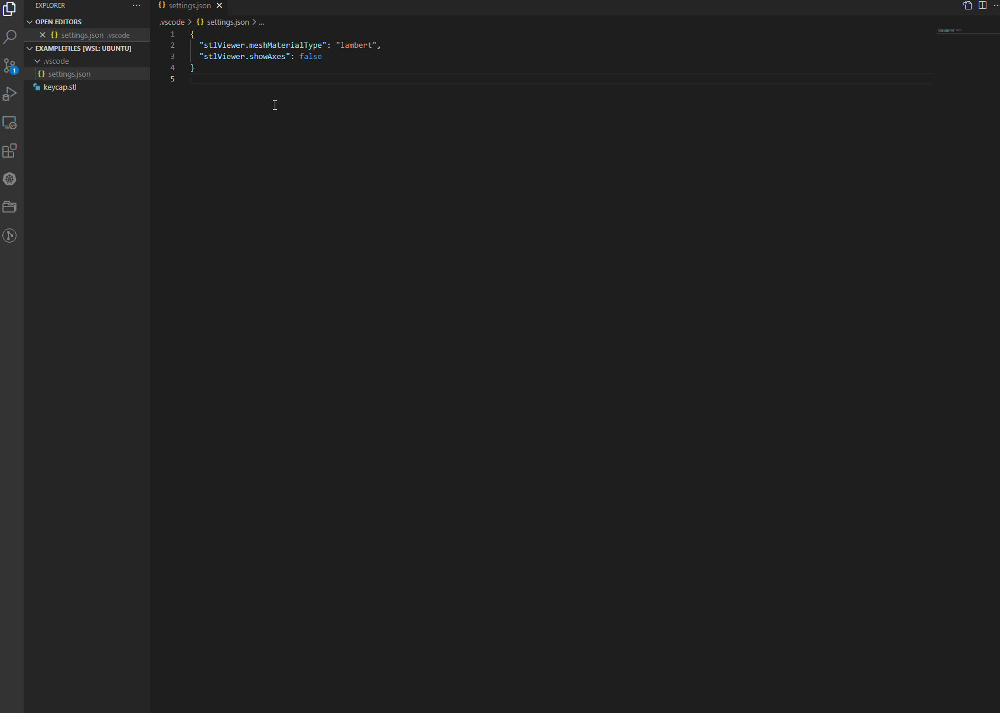

# Features Overview

This document provides a visual overview of STL Previewer's features with detailed descriptions.

## 📊 Feature Matrix

| Feature                | Available | Configurable | Default State |
| ---------------------- | --------- | ------------ | ------------- |
| 3D STL Viewer          | ✅        | ✅           | Always On     |
| Interactive Camera     | ✅        | ❌           | Always On     |
| Git Diff Viewer        | ✅        | ❌           | Auto-detect   |
| View Control Buttons   | ✅        | ✅           | Enabled       |
| Floor Grid             | ✅        | ✅           | Enabled       |
| Axes Helper            | ✅        | ✅           | Disabled      |
| Bounding Box           | ✅        | ✅           | Disabled      |
| Info/Debug Panel       | ✅        | ✅           | Disabled      |
| Material Customization | ✅        | ✅           | Lambert       |
| Wireframe Mode         | ✅        | ✅           | Disabled      |

## 🎨 Visual Features

### 3D Viewer Interface



### Git Diff Visualization

When viewing changes between file versions:


## 🎯 Feature Details

### 1. Interactive 3D Viewer

**Description:**
Real-time 3D rendering of STL files using Three.js WebGL renderer.

**Capabilities:**

- ✅ Smooth rotation with mouse drag
- ✅ Pan camera with right-click drag
- ✅ Zoom with mouse wheel
- ✅ Automatic camera positioning based on object size
- ✅ Responsive to window resizing

**Technical:**

- Uses PerspectiveCamera for realistic 3D view
- OrbitControls for intuitive interaction
- Automatic lighting setup (ambient + directional)
- Real-time rendering loop (60 FPS target)

### 2. Quick View Controls

**Description:**
Preset camera positions for standard viewing angles.

**Available Views:**

1. **Isometric** (Default)

   - 45° angle from corner
   - Shows all three dimensions
   - Best for general visualization

2. **Top View**

   - Looking down on XY plane
   - Shows width and depth
   - Good for floor plan view

3. **Left/Right Views**

   - Side elevation views
   - Shows height and depth
   - Good for profile viewing

4. **Bottom View**
   - Looking up from below
   - Shows underside details
   - Useful for checking bottom features

**Configuration:**

```json
{
  "stlPreviewer.showViewButtons": true,
  "stlPreviewer.viewOffset": 40
}
```

### 3. Git Diff Visualization

**Description:**
Visual comparison of STL file versions using Constructive Solid Geometry (CSG).

**How it Works:**

1. Loads both versions of the file
2. Performs CSG operations using three-bvh-csg:
   - **SUBTRACTION**: New - Old = Added parts (green)
   - **SUBTRACTION**: Old - New = Removed parts (red)
   - **INTERSECTION**: Old ∩ New = Common parts (blue)
3. Renders all three results simultaneously

**Color Coding:**

See the [Git Diff section in Usage Guide](USAGE.md#understanding-diff-colors) for detailed color explanations.

**Transparency:**

- Added and removed parts: 70% opacity
- Allows seeing overlapping geometry
- Intersection shown at 70% opacity

**Use Cases:**

- Verify design changes
- Review modifications before committing
- Quality control for version changes
- Collaboration and code review

### 4. Floor Grid

**Description:**
Reference grid on the ground plane for spatial orientation.

**Characteristics:**

- Infinite grid extending in all directions
- Fades with distance
- Customizable color
- Helps visualize object position relative to origin

**Configuration:**

```json
{
  "stlPreviewer.showGrid": true,
  "stlPreviewer.gridColor": "#333333"
}
```

### 5. Axes Helper

**Description:**
Shows X, Y, Z coordinate axes at the origin.

**Axis Colors:**

- **Red**: X-axis (horizontal)
- **Green**: Y-axis (vertical)
- **Blue**: Z-axis (depth)

**Size:**
Automatically scaled based on object bounding box.

**Configuration:**

```json
{
  "stlPreviewer.showAxes": true
}
```

### 6. Bounding Box

**Description:**
Yellow wireframe box showing object boundaries.

**Purpose:**

- Shows object dimensions
- Indicates object extent in 3D space
- Helps verify object centering
- Useful for collision detection planning

**Configuration:**

```json
{
  "stlPreviewer.showBoundingBox": true
}
```

### 7. Info/Debug Panel

**Description:**
Real-time information panel showing camera and object data.

**Information Displayed:**

- **Camera Position**: X, Y, Z coordinates
- **Camera Rotation**: Euler angles (radians)
- **Bounding Box Width**: X-axis extent
- **Bounding Box Length**: Y-axis extent
- **Bounding Box Height**: Z-axis extent
- **Bounding Box Min/Max**: Coordinate ranges

**Updates:**

- Real-time updates (every frame)
- Values rounded to 2 decimal places
- Automatically repositions to stay visible

**Configuration:**

```json
{
  "stlPreviewer.showInfo": true
}
```

### 8. Material System

**Description:**
Configurable material rendering using Three.js materials.

**Available Materials:**

See the [Material Settings section in Configuration Guide](CONFIGURATION.md#material-settings) for detailed material type descriptions and properties.

### 9. Performance Features

**Automatic Optimizations:**

- Efficient STL parsing (both ASCII and Binary)
- Single-pass rendering
- Optimized camera controls
- Responsive viewport handling

**User-Controllable:**

- Material complexity
- Grid rendering
- Info panel updates
- Visual helpers (axes, bounding box)

**For Large Files:**

See the [Performance Optimization section in Usage Guide](USAGE.md#performance-optimization) for detailed performance tips.

### 10. Responsive Design

**Viewport Handling:**

- Automatically adjusts to window size
- Maintains aspect ratio
- Updates on window resize
- Works in split editor layouts

**UI Positioning:**

- Controls in top-right
- Info panel in top-left
- Both automatically reposition
- Never obscure the model

## 📊 Feature Comparison

| Feature           | Good For                      | Performance Impact |
| ----------------- | ----------------------------- | ------------------ |
| Grid              | Orientation, Depth perception | Low                |
| Axes              | Learning, Debugging           | Very Low           |
| Bounding Box      | Measurements, Boundaries      | Very Low           |
| Info Panel        | Precision work, Debugging     | Low-Medium         |
| Lambert Material  | General viewing               | Low                |
| Phong Material    | Realistic viewing             | Medium             |
| Standard Material | High-quality rendering        | High               |
| Basic Material    | Performance                   | Very Low           |
| View Buttons      | Quick navigation              | Very Low           |
| Git Diff          | Version comparison            | High (CSG)         |

## 🎯 Recommended Settings

### First-Time Users

Enable view buttons and grid for easier orientation.

### CAD/Engineering Work

Enable all helpers (grid, axes, bounding box, info panel).

### Performance-Constrained Systems

Use basic material, disable all helpers.

### Presentations/Screenshots

Phong material, grid only, no other helpers.

### Code Review/Git Diff

Default settings, focus on diff colors.
